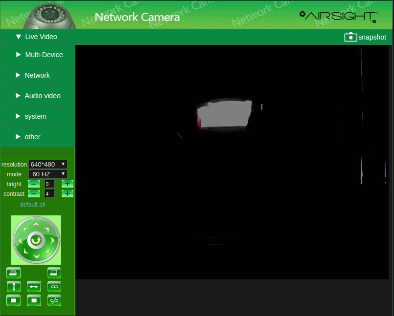

# NetWave Camera API

A simple Python API for interacting with an old NetWave compatible camera you have lying around
somewhere or cheaply acquire.


## Purpose

This is ideal for getting a little more life out of some perfectly good, though probably insecure
IP cameras. Using a combination of Home Assistant and MotionEye, you can get fully automated Pan-Tilt
IP cameras up and working securely with a beautiful and modern web interface and fully integrated with
your existing home automation system. 

## Background
This is a small package for controlling NetWave type IP cameras. This was created by reverse
engineering the web interface for an Airsight XC36A IP camera, but should work for a wide
range of devices. The camera identifies itself as a NetWave device in HTTP requests, but 
mentions Pelco dome cameras in JavaScript, so it can be assumed that the use of the firmware
is widespread. This does not intend to replace the admin dashboard, so configuring the network
and user settings needs to be done from the original dashboard. All of the functionality of the main
video streaming dashboard is recreated in this API. The command line interface for this package is 
primarily intended for debugging since it re-creates the camera object for every command, but it could
also be used with some form of automation if not using Home Assistant.

## Features
- Pan tilt functionality
- Brightness and contrast adjustment
- Resolution and refresh rate configuration
- IO enabling and disabling for X10/Alarm functionality
- Horizontal and vertical patrolling control
- Preset location setting and recalling with 15 slots
- Auto-centering
- Multi-camera support

## Home Assistant Integration
Coming soon

## Manual Installation
```shell script
pip3 install netwave-camera
```

## CLI Usage
All commands and parameters are accessible from the CLI program

```shell script
# Set brightness from command line (integer from 0 to 15)
python3 -m netwave http://url:port/ --user=admin password set brightness 10

# Enable vertical patrolling
python3 -m netwave http://url:port/ --user=admin password command patrol_vertical

# View general help info
python3 -m netwave -h

# View all commands
python3 -m netwave http://url:port/ password command -h
```

## Python Usage
```python
from netwave import NetwaveCamera

# Create camera object
cam = NetwaveCamera('http://url:port/', 'username', 'password', timeout=5)

# Update local camera object with IP camera data
cam.update_full()

# Turn left for ~2 seconds
import time
cam.move_left()
time.sleep(2)
cam.stop_movement()
```

## Documentation
[pydoc API Documentation](https://thelogicmaster.github.io/Netwave-Camera/documentation.html)

[Reverse Engineering Notes](https://thelogicmaster.github.io/Netwave-Camera/camera-reverse-engineering.html)

