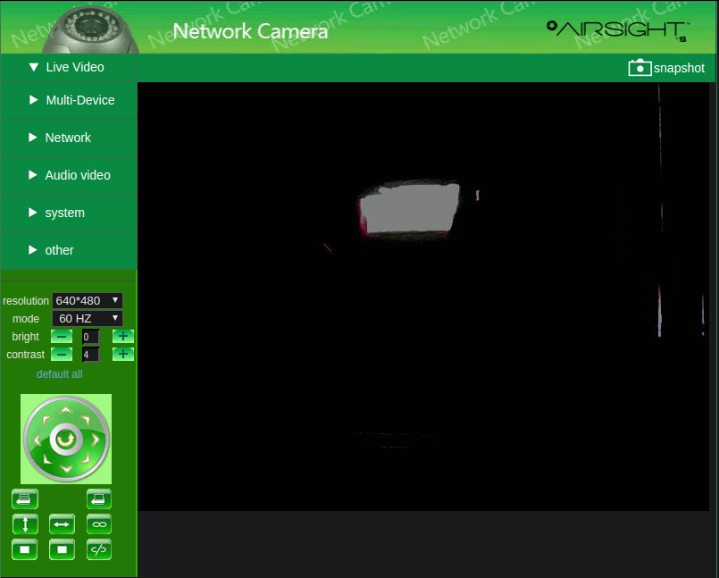

# Netwave Camera
This is a small package for controlling Netwave type IP cameras. This was created by reverse
engineering the web interface for an Airsight XC36A IP camera, but should work for a wide
range of devices. The camera identifies itself as a Netwave device in HTTP requests, but 
mentions Pelco dome cameras in JavaScript, so it can be assumed that the use of the firmware
is widespread. This does not intend to replace the admin dashboard, so configuring the network
and user settings needs to be done from the original dashboard. All of the functionality of the main
video streaming dashboard is recreated in this API. 

## Features
- Pan tilt functionality
- Brightness and contrast adjustment
- Resolution and refresh rate configuration
- IO enabling and disabling for X10/Alarm functionality
- Horizontal and vertical patrolling control
- Preset location setting and recalling with 15 slots
- Auto-centering

## Installation
```shell script
pip install netwave-camera
```

## CLI Usage
All commands and parameters are accessible from the CLI program

```shell script
# Set brightness from command line (integer from 0 to 15)
python3 netwave http://url:port/ --user=admin password set brightness 10

# Enable vertical patrolling
python3 netwave http://url:port/ --user=admin password command patrol_vertical

# View general help info
python3 netwave -h

# View all commands
python3 netwave http://url:port/ password command -h
```

## Python Usage
```python
from netwave import NetwaveCamera

# Create camera object
cam = NetwaveCamera('http://url:port/', 'username', 'password', timeout=5)

# Update local camera object with IP camera data
cam.update_full()

# Turn left for ~2 seconds
import time
cam.move_left()
time.sleep(2)
cam.stop_movement()
```

## Documentation
The pydoc API documentaion is availible in the media directory along with the reverse engineering notes

